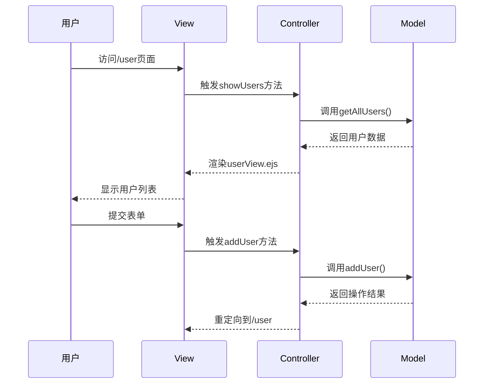

# Install dependencies

```bash
npm install express ejs
```
>
    Express:
        Express 是一个快速、灵活且极简的 Node.js Web 应用框架，它提供了一系列强大的功能来帮助开发者构建 Web 应用和 API。
        - 它简化了服务器的构建过程，处理 HTTP 请求和响应，提供路由功能、处理中间件、支持各种模板引擎等。
        - 使用 Express，你可以快速搭建一个基于 Node.js 的服务器，并实现 RESTful API。

>
    EJS (Embedded JavaScript Templates):
        EJS 是一种模板引擎，允许开发者在 HTML 中嵌入 JavaScript 代码，以动态生成 HTML 内容。
        - 使用 EJS，可以在服务器端渲染动态页面内容，比如将数据传递给模板，然后生成最终的 HTML 响应。
        - EJS 语法简单，易于学习，适合用在需要根据数据动态生成页面的场景。


# Run service

```bash
node app.js
```

# Test

GET http://localhost:3000/users

