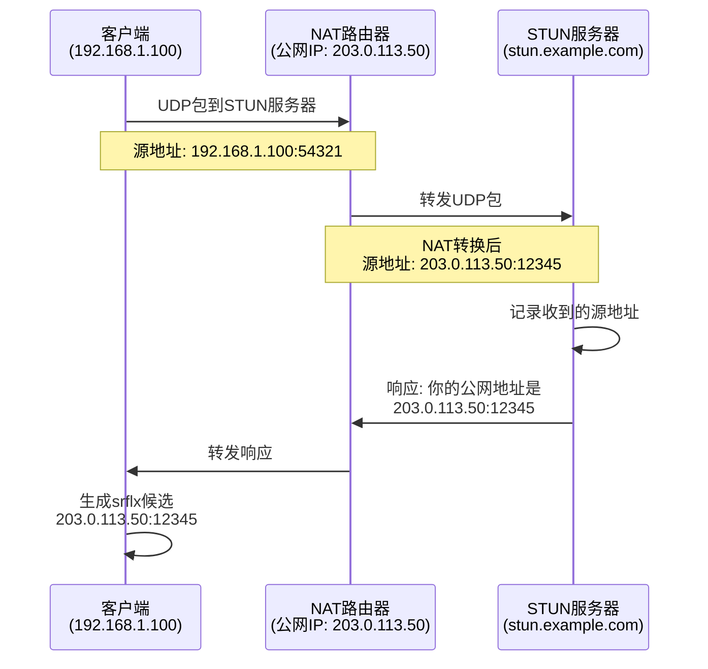
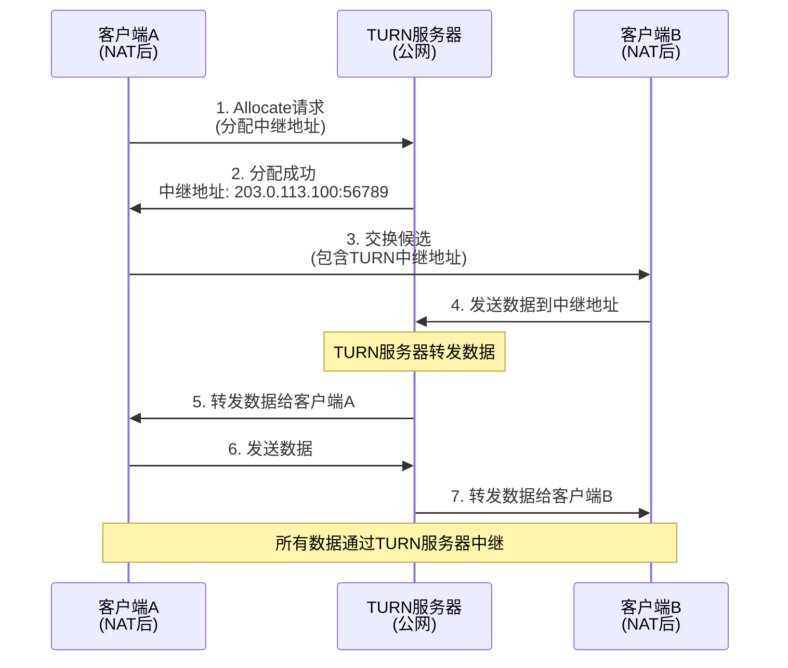
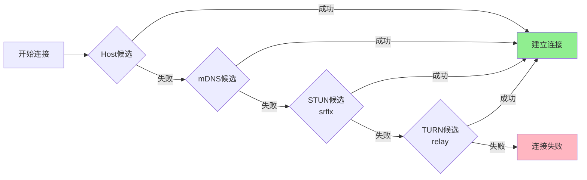
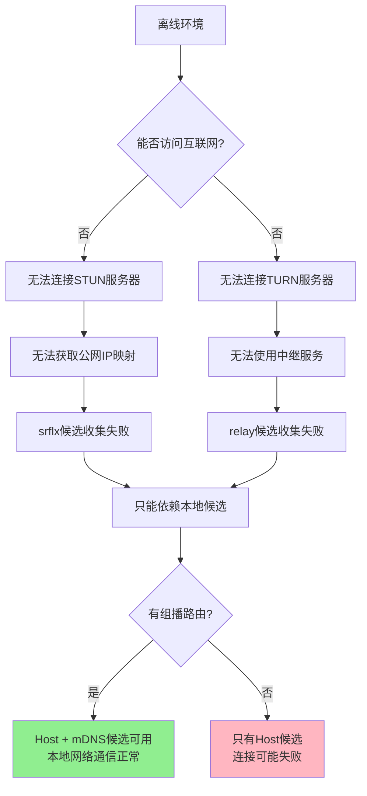
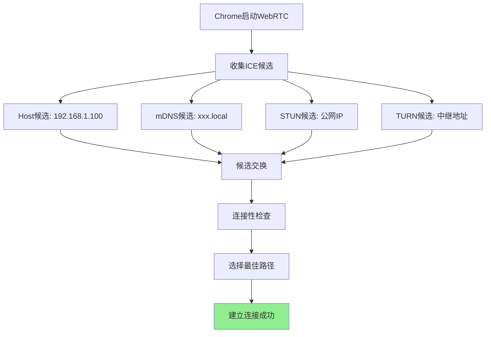
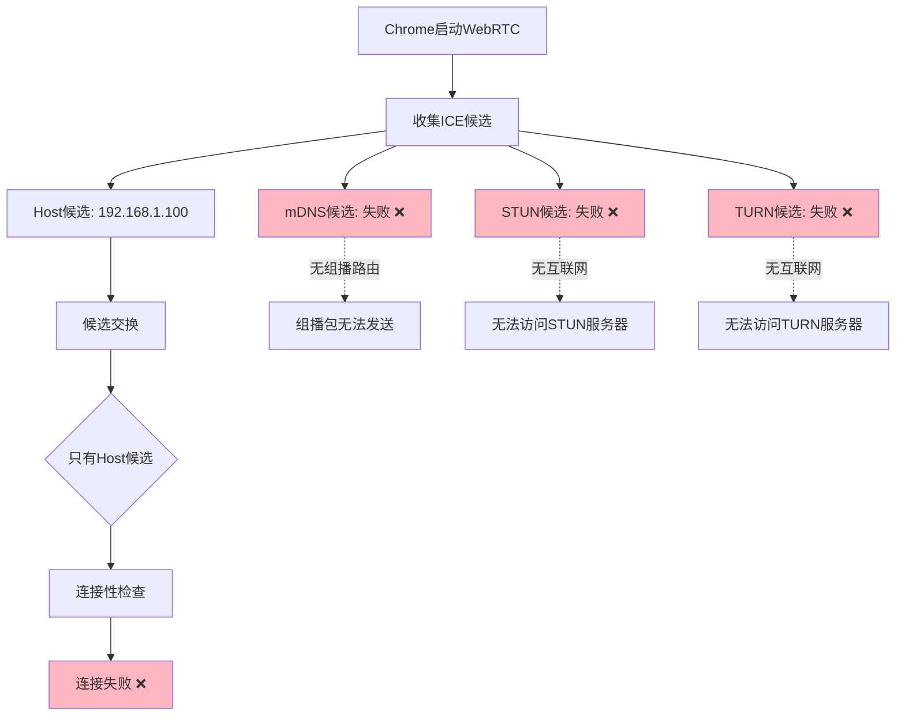
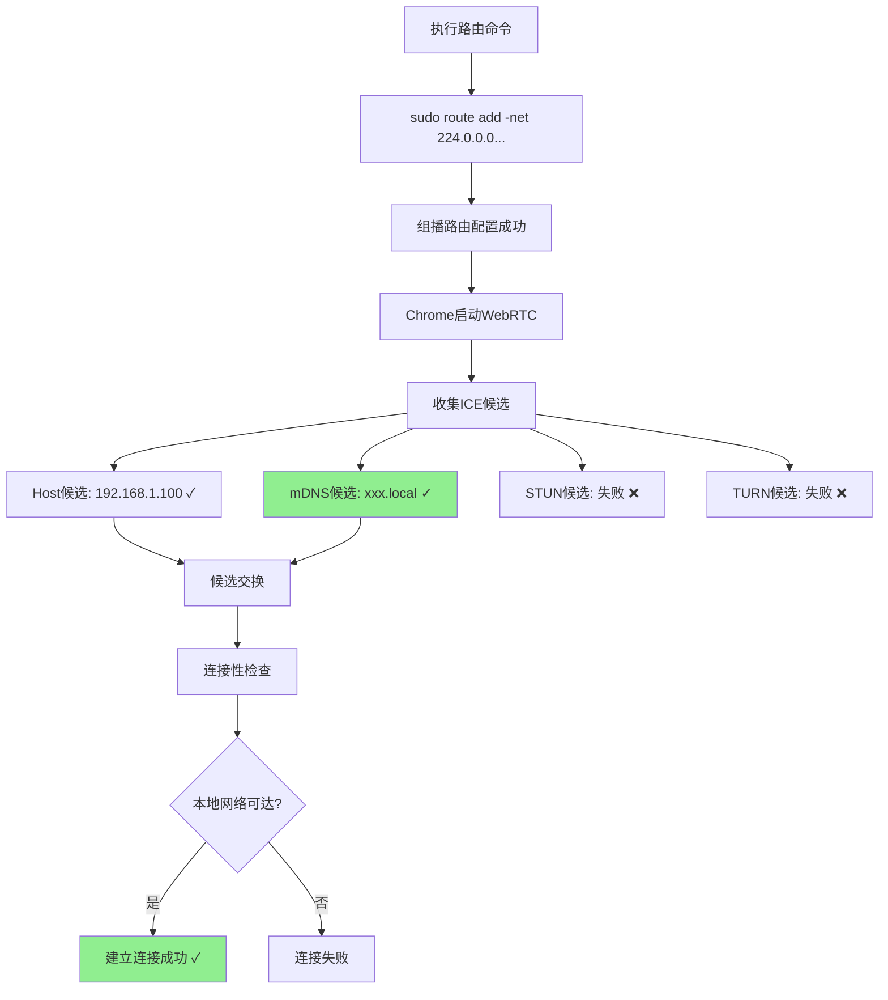
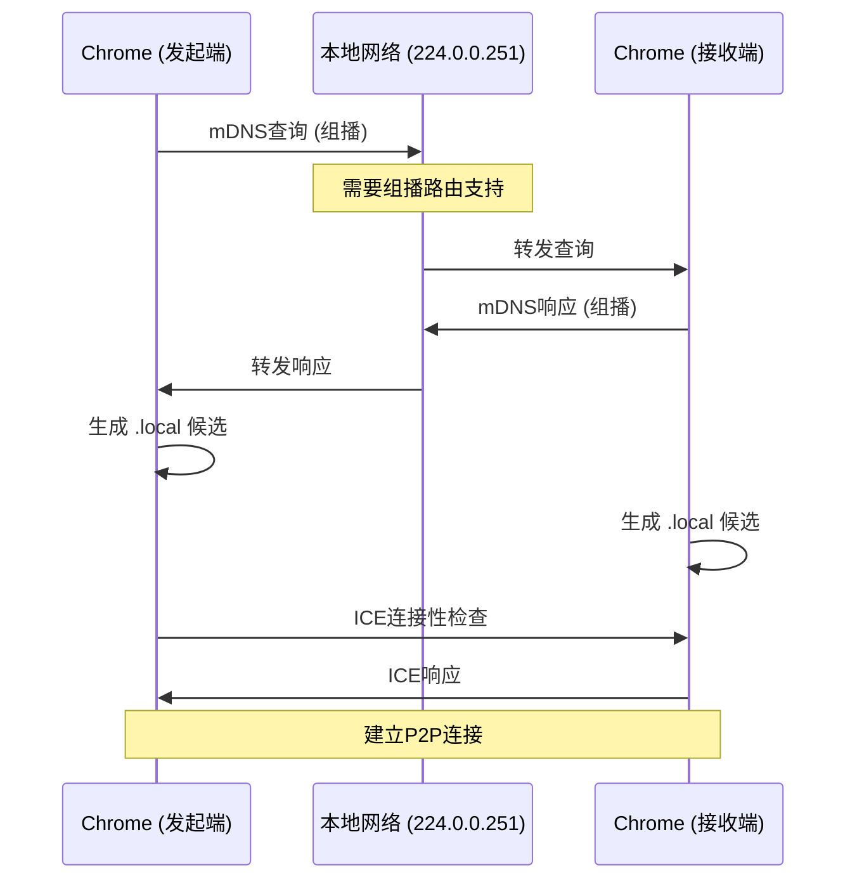

# Chrome WebRTC 离线环境组播路由问题

## 问题描述

在谷歌浏览器无法联网的情况下，需要执行以下命令才能正常播放WebRTC视频：

```bash
sudo /sbin/route add -net 224.0.0.0 netmask 224.0.0.0 dev eno1
```

## 问题根源

### 组播地址与mDNS

- **组播地址范围**：224.0.0.0 - 239.255.255.255 (224.0.0.0/4)
- **mDNS地址**：224.0.0.251:5353
- **用途**：WebRTC使用mDNS进行本地网络设备发现

### WebRTC的ICE候选机制

WebRTC使用ICE (Interactive Connectivity Establishment) 协议建立连接，需要收集多种类型的候选地址：

1. **Host候选**：本地网络接口的IP地址
2. **mDNS候选**：通过组播DNS发现的本地地址（格式：xxx.local）
3. **srflx候选**：通过STUN服务器获取的公网映射地址
4. **relay候选**：通过TURN服务器中继的地址

### ICE候选类型详解

#### 1. Host候选（本地候选）

**定义**：设备本地网络接口的IP地址和端口。

**特点**：
- 不需要外部服务器
- 延迟最低，性能最好
- 仅适用于同一局域网内的通信
- 无法穿透NAT

**示例**：
```json
{
  "type": "host",
  "protocol": "udp",
  "address": "192.168.1.100",
  "port": 54321,
  "priority": 2130706431
}
```

#### 2. mDNS候选（本地发现候选）

**定义**：通过组播DNS（mDNS）协议发现的本地网络地址，使用`.local`域名格式。

**工作原理**：
- 向组播地址224.0.0.251:5353发送查询
- 本地网络中的设备响应查询
- 生成形如`a1b2c3d4.local`的候选地址

**特点**：
- 保护隐私：不暴露真实IP地址
- 仅用于本地网络通信
- **依赖组播路由**（这就是离线环境需要配置的原因）
- Chrome默认启用此功能

**示例**：
```json
{
  "type": "host",
  "protocol": "udp",
  "address": "a1b2c3d4-e5f6-7890-abcd-ef1234567890.local",
  "port": 54322,
  "priority": 2130706430
}
```

#### 3. STUN候选（srflx - Server Reflexive）

**定义**：通过STUN服务器发现的公网IP地址和端口映射。

**STUN (Session Traversal Utilities for NAT) 工作原理**：



**特点**：
- 用于NAT穿透
- 发现公网IP和端口映射
- 适用于大多数NAT类型（除了对称NAT）
- **需要互联网连接**访问STUN服务器
- 免费的公共STUN服务器：
  - `stun:stun.l.google.com:19302`
  - `stun:stun1.l.google.com:19302`
  - `stun:stun.stunprotocol.org:3478`

**示例**：
```json
{
  "type": "srflx",
  "protocol": "udp",
  "address": "203.0.113.50",
  "port": 12345,
  "relatedAddress": "192.168.1.100",
  "relatedPort": 54321,
  "priority": 1694498815
}
```

**NAT类型与STUN的关系**：

| NAT类型 | STUN是否有效 | 说明 |
|---------|-------------|------|
| Full Cone NAT | ✓ 有效 | 任何外部主机都可以通过映射的公网地址访问 |
| Restricted Cone NAT | ✓ 有效 | 只有客户端曾经发送过数据的主机可以访问 |
| Port Restricted Cone NAT | ✓ 有效 | 只有客户端曾经发送过数据的主机:端口可以访问 |
| Symmetric NAT | ✗ 无效 | 每个目标地址都有不同的映射，需要TURN |

#### 4. TURN候选（relay - 中继候选）

**定义**：通过TURN服务器中继的地址，当直连失败时使用。

**TURN (Traversal Using Relays around NAT) 工作原理**：



**特点**：
- 最后的备选方案（fallback）
- 保证连接成功率（几乎100%）
- **消耗服务器带宽**：所有数据都经过TURN服务器
- **延迟较高**：数据需要中转
- **需要互联网连接**访问TURN服务器
- 通常需要认证（用户名/密码）
- 可能需要付费（因为消耗带宽）

**示例**：
```json
{
  "type": "relay",
  "protocol": "udp",
  "address": "203.0.113.100",
  "port": 56789,
  "relatedAddress": "192.168.1.100",
  "relatedPort": 54321,
  "priority": 16777215
}
```

**TURN服务器配置示例**：
```javascript
const configuration = {
  iceServers: [
    {
      urls: 'stun:stun.l.google.com:19302'
    },
    {
      urls: 'turn:turn.example.com:3478',
      username: 'user',
      credential: 'password'
    }
  ]
};

const peerConnection = new RTCPeerConnection(configuration);
```

### ICE候选优先级

WebRTC会按照以下优先级尝试连接：



**优先级排序**（从高到低）：
1. **Host候选** - 最快，零延迟，但仅限本地网络
2. **mDNS候选** - 本地网络，保护隐私
3. **srflx候选** - NAT穿透，适用于大多数情况
4. **relay候选** - 保底方案，延迟最高但成功率最高

### 为什么离线环境下STUN/TURN不可用



**原因分析**：

1. **STUN服务器不可达**
   - STUN服务器通常在公网上（如`stun.l.google.com`）
   - 离线环境无法建立UDP连接到外部服务器
   - 无法获取NAT映射的公网地址

2. **TURN服务器不可达**
   - TURN服务器也在公网上
   - 需要认证和持续连接
   - 离线环境无法分配中继地址

3. **只能依赖本地候选**
   - Host候选：仍然可用
   - mDNS候选：需要组播路由支持
   - 如果没有组播路由，只剩Host候选
   - Host候选可能因为网络拓扑无法直连

### 不同网络环境下的候选可用性

| 网络环境 | Host | mDNS | STUN (srflx) | TURN (relay) | 适用场景 |
|---------|------|------|--------------|--------------|---------|
| 同一局域网 | ✓ | ✓ | ✓ | ✓ | 最理想，所有候选都可用 |
| 不同局域网（有互联网） | ✓ | ✗ | ✓ | ✓ | 常见场景，通过STUN/TURN穿透 |
| 离线局域网（有组播路由） | ✓ | ✓ | ✗ | ✗ | 本文讨论的场景 |
| 离线局域网（无组播路由） | ✓ | ✗ | ✗ | ✗ | 最困难，只能直连 |
| 对称NAT环境 | ✓ | ✓ | ✗ | ✓ | 必须使用TURN |

## 联网 vs 不联网行为对比

### 联网情况下



**路由表状态**：
```bash
# 联网时的路由表
default via 192.168.1.1 dev eno1
192.168.1.0/24 dev eno1 proto kernel scope link
224.0.0.0/4 dev eno1 scope link  # 组播路由自动配置
```

**特点**：
- ✅ 组播路由自动配置
- ✅ 所有类型候选都可用
- ✅ 有多条备用路径
- ✅ mDNS失败也不影响（有STUN/TURN兜底）

### 不联网情况（无组播路由）



**路由表状态**：
```bash
# 不联网时的路由表（缺少组播路由）
192.168.1.0/24 dev eno1 proto kernel scope link
# 注意：没有 224.0.0.0/4 组播路由！
```

**问题链**：
```
无组播路由 → mDNS查询失败 → .local候选无法生成
     ↓
无互联网 → STUN/TURN不可用 → 公网候选无法生成
     ↓
只剩Host候选 → 对端可能无法直接访问 → 连接失败
```

### 不联网情况（添加组播路由后）



**路由表状态**：
```bash
# 添加组播路由后
192.168.1.0/24 dev eno1 proto kernel scope link
224.0.0.0/4 dev eno1 scope link  # 手动添加的组播路由
```

**改善**：
- ✅ 组播路由已配置
- ✅ mDNS候选恢复
- ✅ 本地网络WebRTC可用
- ❌ 仍无法访问外网STUN/TURN（但不需要）

## 详细对比表

| 项目 | 联网情况 | 不联网（无组播路由） | 不联网（有组播路由） |
|------|---------|---------------------|---------------------|
| 默认网关 | ✓ 存在 | ✗ 不存在/不可达 | ✗ 不存在/不可达 |
| 组播路由 | ✓ 自动配置 | ✗ 缺失 | ✓ 手动配置 |
| Host候选 | ✓ 可用 | ✓ 可用 | ✓ 可用 |
| mDNS候选 | ✓ 可用 | ✗ 失败 | ✓ 可用 |
| STUN候选 | ✓ 可用 | ✗ 不可用 | ✗ 不可用 |
| TURN候选 | ✓ 可用 | ✗ 不可用 | ✗ 不可用 |
| 本地网络通信 | ✓ 正常 | ✗ 失败 | ✓ 正常 |
| 跨网段通信 | ✓ 正常 | ✗ 失败 | ✗ 失败 |

## 解决方案

### 临时方案（重启后失效）

```bash
# 添加组播路由
sudo /sbin/route add -net 224.0.0.0 netmask 224.0.0.0 dev eno1

# 或使用更现代的ip命令（推荐）
sudo ip route add 224.0.0.0/4 dev eno1
```

### 永久方案

#### 方法1：使用systemd-networkd

创建配置文件 `/etc/systemd/network/10-multicast.network`：

```ini
[Match]
Name=eno1

[Route]
Destination=224.0.0.0/4
Scope=link
```

然后重启网络服务：
```bash
sudo systemctl restart systemd-networkd
```

#### 方法2：使用NetworkManager

创建dispatcher脚本 `/etc/NetworkManager/dispatcher.d/99-multicast-route`：

```bash
#!/bin/bash
if [ "$1" = "eno1" ] && [ "$2" = "up" ]; then
    /sbin/ip route add 224.0.0.0/4 dev eno1 2>/dev/null || true
fi
```

设置执行权限：
```bash
sudo chmod +x /etc/NetworkManager/dispatcher.d/99-multicast-route
```

#### 方法3：使用rc.local

在 `/etc/rc.local` 中添加：

```bash
#!/bin/bash
/sbin/ip route add 224.0.0.0/4 dev eno1
exit 0
```

## 诊断流程

```mermaid
flowchart TD
    Start[WebRTC视频无法播放] --> Check1{能否联网?}

    Check1 -->|是| A[问题不在组播路由]
    Check1 -->|否| Check2[检查组播路由]

    Check2 --> Cmd1[执行: ip route show | grep 224]
    Cmd1 --> Check3{有224.0.0.0/4路由?}

    Check3 -->|是| B[组播路由正常]
    Check3 -->|否| Fix1[添加组播路由]

    Fix1 --> Cmd2[sudo ip route add 224.0.0.0/4 dev eno1]
    Cmd2 --> Test1[测试WebRTC]

    Test1 --> Check4{是否正常?}
    Check4 -->|是| Success[问题解决 ✓]
    Check4 -->|否| Check5[检查其他问题]

    B --> Check6[检查网络接口]
    Check6 --> Cmd3[ip link show eno1 | grep MULTICAST]

    Check5 --> Debug1[查看chrome://webrtc-internals/]
    Debug1 --> Debug2[检查ICE候选收集情况]

    style Success fill:#90EE90
    style Fix1 fill:#FFD700
```

## 验证方法

### 1. 检查路由表

```bash
# 查看所有路由
ip route show

# 查看组播路由
ip route show | grep 224

# 查看详细路由表
route -n | grep 224
```

### 2. 检查网络接口组播状态

```bash
# 检查接口是否支持组播
ip link show eno1 | grep MULTICAST

# 查看组播组成员
ip maddr show dev eno1

# 查看组播路由表
ip mroute show
```

### 3. 使用Chrome内部工具

打开 `chrome://webrtc-internals/` 查看ICE候选收集情况。

**联网时的候选示例**：
```json
{
  "type": "host",
  "ip": "192.168.1.100",
  "port": 54321
},
{
  "type": "mdns",
  "address": "a1b2c3d4.local",
  "port": 54322
},
{
  "type": "srflx",
  "ip": "203.0.113.1",
  "port": 12345
}
```

**不联网且无组播路由时**：
```json
{
  "type": "host",
  "ip": "192.168.1.100",
  "port": 54321
}
// 只有host候选，mDNS和srflx都失败
```

**添加组播路由后**：
```json
{
  "type": "host",
  "ip": "192.168.1.100",
  "port": 54321
},
{
  "type": "mdns",
  "address": "a1b2c3d4.local",
  "port": 54322
}
// mDNS候选恢复
```

### 4. 测试组播连通性

```bash
# 安装测试工具
sudo apt-get install avahi-utils

# 测试mDNS
avahi-browse -a

# 使用tcpdump监听组播流量
sudo tcpdump -i eno1 'dst net 224.0.0.0/4'
```

### 5. 测试STUN/TURN服务器

#### 使用在线工具测试

访问 [Trickle ICE](https://webrtc.github.io/samples/src/content/peerconnection/trickle-ice/) 测试STUN/TURN服务器连通性。

#### 使用命令行工具测试STUN

```bash
# 安装stun客户端
sudo apt-get install stun-client

# 测试Google的STUN服务器
stun stun.l.google.com -p 19302

# 输出示例：
# STUN client version 0.97
# Primary: Independent Mapping, Port Dependent Filter
# Return value is 0x000001
```

#### 使用Node.js测试STUN/TURN

创建测试脚本 `test-ice.js`：

```javascript
const RTCPeerConnection = require('wrtc').RTCPeerConnection;

const config = {
  iceServers: [
    { urls: 'stun:stun.l.google.com:19302' },
    // 如果有TURN服务器，添加：
    // {
    //   urls: 'turn:turn.example.com:3478',
    //   username: 'user',
    //   credential: 'password'
    // }
  ]
};

const pc = new RTCPeerConnection(config);

pc.onicecandidate = (event) => {
  if (event.candidate) {
    console.log('发现候选:', event.candidate.type, event.candidate.address);
  } else {
    console.log('候选收集完成');
    pc.close();
  }
};

// 创建数据通道触发ICE收集
pc.createDataChannel('test');
pc.createOffer()
  .then(offer => pc.setLocalDescription(offer))
  .catch(err => console.error('错误:', err));
```

运行测试：
```bash
npm install wrtc
node test-ice.js
```

#### 使用Python测试STUN

```python
#!/usr/bin/env python3
import socket
import struct

def test_stun(stun_host='stun.l.google.com', stun_port=19302):
    """测试STUN服务器并获取公网IP"""
    # STUN Binding Request
    trans_id = b'\x00' * 12
    message = b'\x00\x01\x00\x00' + b'\x21\x12\xa4\x42' + trans_id

    sock = socket.socket(socket.AF_INET, socket.SOCK_DGRAM)
    sock.settimeout(3)

    try:
        sock.sendto(message, (stun_host, stun_port))
        data, addr = sock.recvfrom(1024)

        # 解析响应
        if len(data) > 20:
            # 查找MAPPED-ADDRESS属性
            pos = 20
            while pos < len(data):
                attr_type = struct.unpack('!H', data[pos:pos+2])[0]
                attr_len = struct.unpack('!H', data[pos+2:pos+4])[0]

                if attr_type == 0x0001:  # MAPPED-ADDRESS
                    port = struct.unpack('!H', data[pos+6:pos+8])[0]
                    ip = '.'.join(str(b) for b in data[pos+8:pos+12])
                    print(f'✓ STUN服务器可达')
                    print(f'  公网地址: {ip}:{port}')
                    return True

                pos += 4 + attr_len

        print('✗ STUN响应格式错误')
        return False

    except socket.timeout:
        print('✗ STUN服务器超时（可能无法联网）')
        return False
    except Exception as e:
        print(f'✗ STUN测试失败: {e}')
        return False
    finally:
        sock.close()

if __name__ == '__main__':
    print('测试STUN服务器连通性...')
    test_stun()
```

运行测试：
```bash
chmod +x test-stun.py
./test-stun.py
```

**联网时的输出**：
```
测试STUN服务器连通性...
✓ STUN服务器可达
  公网地址: 203.0.113.50:12345
```

**离线时的输出**：
```
测试STUN服务器连通性...
✗ STUN服务器超时（可能无法联网）
```

## 技术细节

### mDNS工作原理



### 为什么联网时不需要手动配置

1. **网络管理器自动处理**
   - NetworkManager/systemd-networkd会自动配置组播路由
   - DHCP客户端获取IP时设置完整路由表

2. **内核默认行为**
   - 网络接口up时，内核可能自动添加组播路由
   - 取决于接口配置和系统设置

3. **网络栈完整性**
   - 联网时网络栈处于完全激活状态
   - 所有必要的路由规则都已就位

## 常见问题

### Q1: 为什么netmask是224.0.0.0而不是240.0.0.0？

命令中的netmask确实不太标准。更准确的应该是：
```bash
sudo ip route add 224.0.0.0/4 dev eno1
# 等价于 netmask 240.0.0.0
```

但224.0.0.0的netmask在某些情况下也能工作，因为它仍然覆盖了mDNS使用的224.0.0.251地址。

### Q2: 为什么只影响Chrome，不影响其他浏览器？

不同浏览器的WebRTC实现有差异：
- Chrome/Chromium：严格依赖mDNS进行本地发现
- Firefox：可能有不同的候选收集策略
- Safari：使用不同的WebRTC实现

### Q3: 可以禁用mDNS吗？

可以通过Chrome策略禁用：
```bash
# 启动Chrome时添加参数
google-chrome --disable-features=WebRtcHideLocalIpsWithMdns
```

但这会暴露本地IP地址，存在隐私问题。

### Q4: 为什么重启后路由消失？

使用`route add`或`ip route add`添加的路由是临时的，重启后会丢失。需要使用永久方案（见上文）。

### Q5: 可以在离线环境下搭建本地STUN/TURN服务器吗？

**可以，但意义不大**：

**STUN服务器**：
- 在离线局域网内搭建STUN服务器没有意义
- STUN的作用是发现NAT后的公网IP
- 局域网内不存在"公网IP"的概念
- 直接使用Host候选即可

**TURN服务器**：
- 可以在局域网内搭建TURN服务器作为中继
- 但这会增加延迟和复杂度
- 不如直接配置组播路由，使用mDNS候选

**推荐方案**：
```bash
# 离线环境下，配置组播路由即可
sudo ip route add 224.0.0.0/4 dev eno1
```

如果确实需要搭建，可以使用：
- **coturn**：开源TURN服务器
- **restund**：轻量级STUN/TURN服务器

```bash
# 安装coturn
sudo apt-get install coturn

# 配置 /etc/turnserver.conf
listening-port=3478
realm=local.network
server-name=turn.local
lt-cred-mech
user=testuser:testpass

# 启动服务
sudo systemctl start coturn
```

### Q6: 如何判断WebRTC使用了哪种候选类型？

打开 `chrome://webrtc-internals/`，查看 **Stats graphs for RTCIceCandidatePair** 部分：

```
Selected candidate pair:
  Local:  host 192.168.1.100:54321
  Remote: host 192.168.1.101:54322
  State:  succeeded
```

**候选类型判断**：
- `host` → 直连（最佳）
- `srflx` → 通过STUN穿透NAT
- `relay` → 通过TURN中继（延迟最高）

### Q7: STUN和TURN服务器需要付费吗？

**STUN服务器**：
- 大多数是免费的（如Google的STUN服务器）
- 消耗带宽很小（只是查询公网IP）
- 可以自己搭建

**TURN服务器**：
- 通常需要付费（因为中继所有数据流量）
- 消耗大量带宽
- 免费服务有限制（如每月流量限制）
- 商业方案：
  - Twilio（按使用量计费）
  - Xirsys（订阅制）
  - Metered.ca（有免费额度）

### Q8: 为什么有时候连接很慢？

可能是ICE候选收集和连接性检查耗时：

```mermaid
gantt
    title ICE连接建立时间线
    dateFormat X
    axisFormat %Ls

    section 候选收集
    Host候选      :0, 100
    mDNS候选      :0, 500
    STUN候选      :0, 2000
    TURN候选      :0, 3000

    section 连接检查
    Host尝试      :100, 200
    mDNS尝试      :500, 300
    STUN尝试      :2000, 500
    TURN尝试      :3000, 1000

    section 结果
    连接建立      :milestone, 3500, 0
```



**优化建议**：
1. 优先使用本地网络（Host/mDNS）
2. 配置可靠的STUN服务器
3. 只在必要时使用TURN
4. 使用Trickle ICE（逐步交换候选，不等待全部收集完成）

## 参考资料

### WebRTC相关
- [WebRTC ICE Candidate Types](https://developer.mozilla.org/en-US/docs/Web/API/RTCIceCandidate)
- [WebRTC API Documentation](https://developer.mozilla.org/en-US/docs/Web/API/WebRTC_API)
- [Chrome WebRTC Internals](chrome://webrtc-internals/)

### ICE/STUN/TURN协议
- [RFC 8445 - ICE (Interactive Connectivity Establishment)](https://datatracker.ietf.org/doc/html/rfc8445)
- [RFC 8489 - STUN (Session Traversal Utilities for NAT)](https://datatracker.ietf.org/doc/html/rfc8489)
- [RFC 8656 - TURN (Traversal Using Relays around NAT)](https://datatracker.ietf.org/doc/html/rfc8656)

### mDNS和组播
- [RFC 6762 - mDNS (Multicast DNS)](https://datatracker.ietf.org/doc/html/rfc6762)
- [Linux Multicast Routing](https://www.kernel.org/doc/html/latest/networking/multicast.html)

### 公共STUN/TURN服务器
- [Google Public STUN Server](https://webrtc.github.io/samples/src/content/peerconnection/trickle-ice/)
- [Free STUN Server List](https://gist.github.com/mondain/b0ec1cf5f60ae726202e)
- [Open Relay Project](https://www.metered.ca/tools/openrelay/) - 免费TURN服务器

## 总结

在离线环境下，Chrome的WebRTC需要组播路由支持才能正常工作，因为：

1. **mDNS依赖组播**：本地设备发现需要向224.0.0.251发送组播包
2. **离线环境缺少自动配置**：没有网络管理器自动配置组播路由
3. **无法使用STUN/TURN**：只能依赖本地网络候选
4. **手动添加路由解决**：明确告诉系统如何处理组播流量

这个问题本质上是网络配置问题，而非Chrome的bug。在正常联网环境下，这些配置都是自动完成的。
